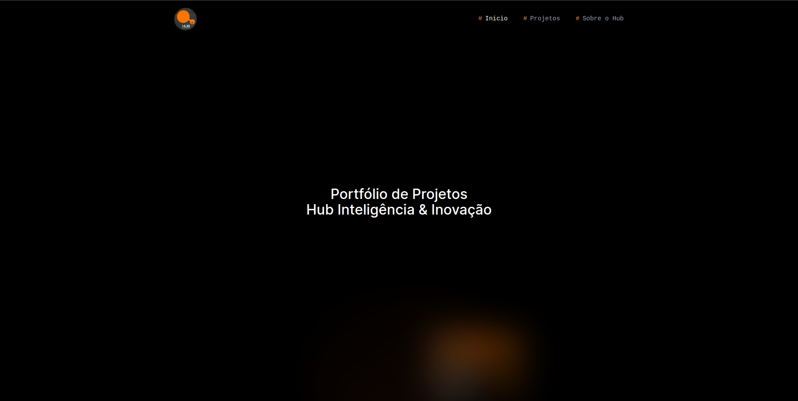
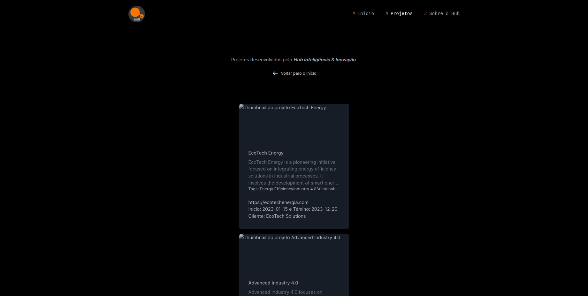
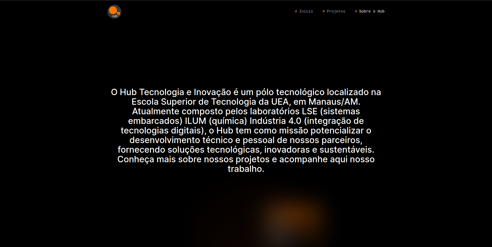

Projeto desenvolvido com intuito de cumprir com o desafio oferecido pelo Hub Tecnologia & Inovação

# Portfólio de Projetos

- Preview: [https://desafio-hub.vercel.app](https://desafio-hub.vercel.app)

## Interfaces

### Início


### Projetos


### Sobre


Este projeto foi desenvolvido em:

- NextJS (Framework React);
- TypeScript = linguagem de programação (superset de JS);
- Tailwind CSS = estrutura CSS utilitária;

###### >>>>>

Para rodar localmente:

- Faça o clone do repositório na sua máquina;
- Abra o terminal e digite :
```bash
npm i
```
- Altere a branch para develop;
```bash
git checkout develop
```
- Depois, rode:
```bash
npm run dev
```

Abra em seu navegador [http://localhost:3000](http://localhost:3000) e navegue na aplicação :)

###### >>>>>

